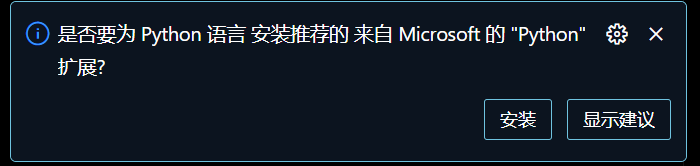
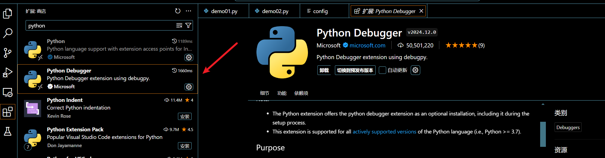
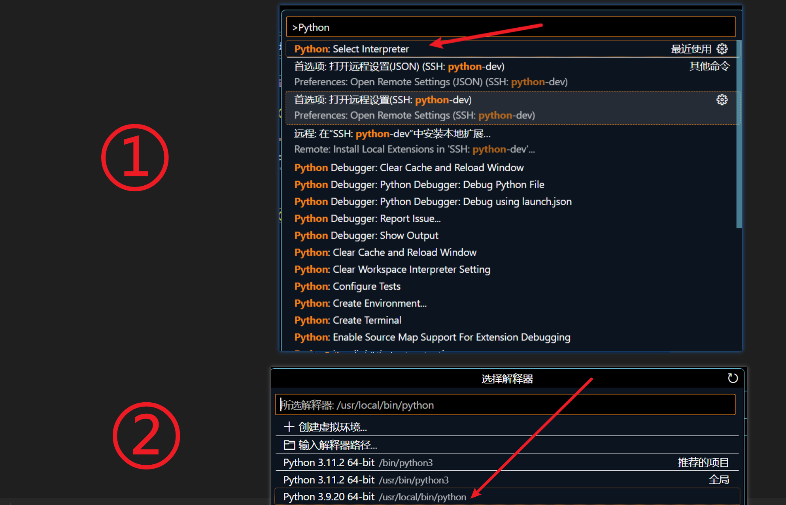
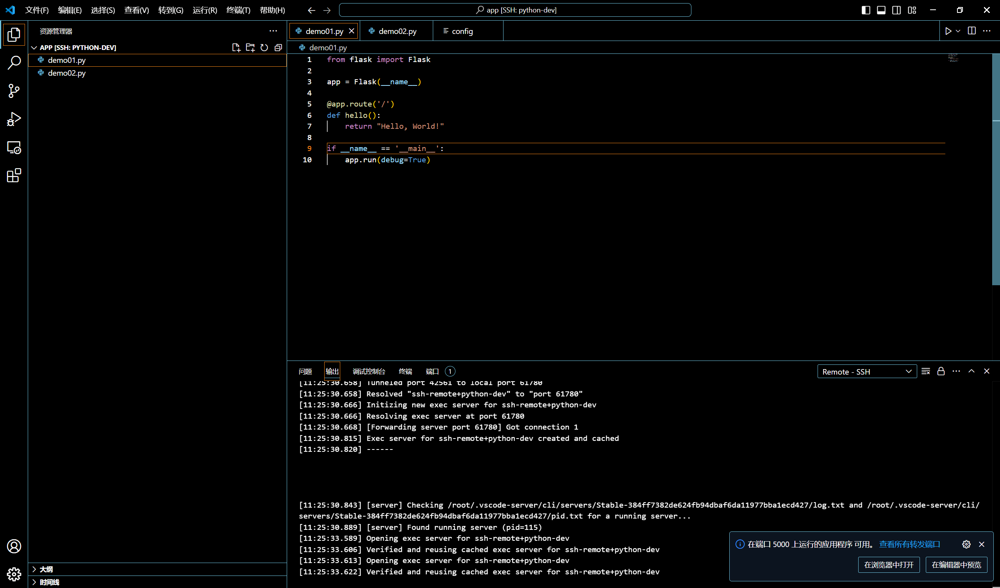
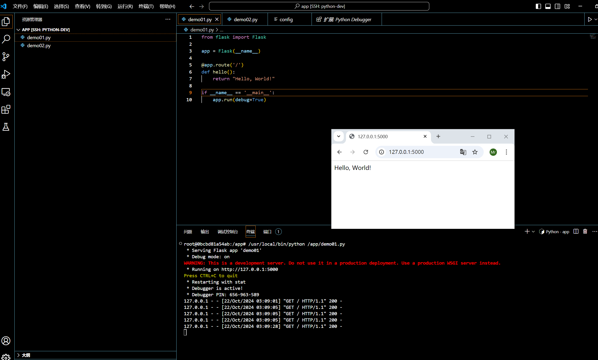

# 关于构建Python3远程开发

> 初始版本MD5值：`cef3bb682129a1a8ff1cf97530964f89`

```dockerfile
# 使用官方的 Python 3.9 镜像
FROM python:3.9

# 设置工作目录
WORKDIR /app

# 设置代理环境变量
ENV http_proxy=http://192.168.100.1:13038
ENV https_proxy=http://192.168.100.1:13038

# 设置国内 pip 源
RUN pip config set global.index-url https://pypi.tuna.tsinghua.edu.cn/simple

# 安装常用的 Python 库
RUN pip install --no-cache-dir \
    flask \
    requests \
    numpy \
    pandas \
    matplotlib \
    scikit-learn \
    jupyter \
    beautifulsoup4

# 安装 SSH 服务
RUN apt-get update && \
    apt-get install -y openssh-server vim && \
    apt-get clean && \
    rm -rf /var/lib/apt/lists/*

# 修改 SSH 配置
RUN mkdir /var/run/sshd && \
    echo 'PermitRootLogin yes' >> /etc/ssh/sshd_config && \
    echo 'Port 10008' >> /etc/ssh/sshd_config

# 设置 root 用户连接密码
RUN echo 'root:Asd@123' | chpasswd

# 暴露容器的 8000 和 10008 端口
EXPOSE 8000 10008

# 设置环境变量
ENV PYTHONUNBUFFERED=1

# 启动 SSH 服务
CMD service ssh start && bash
```

构建镜像

```shell
docker build -t python39_dev:v1 .
```

验证

```shell
docker run -itd -p 10008:10008 -v /root/app:/app --name my_python_container python39_dev:v1
```

如果出现密钥问题，清除掉

`Win + R`，输入以下：

```shell
notepad c:\Users\wzy\.ssh\known_hosts
```

# VScode 操作

首先`ctrl + shift + p`，然后搜索`Open SSH`，打开配置文件后，添加如下配置：

```shell
Host Python
  HostName 192.168.100.201
  Port 10008
  User root
  ForwardAgent yes
```

然后`ctrl + shift + p`，然后搜索`Connect to`，输入我们的`Python`，回车，按照提示操作即可连接到远程Docker

打包离线镜像（因为暂时没有`harbor`仓库）

```shell
docker save -o python39-dev_v1.tar python39_dev:v1
```

# 注意事项

连接上以后，会提示安装一个`Python`插件，**不要安装这个插件**



这个插件默认使用的解释器版本是`python3.11`，这样会导致包无法导入

（会没有运行按钮，直接`python demo01.py`运行，或者手工安装下面这个插件`Python Debugger`，即可有运行按钮）



解决方法：

如果已经安装了插件无法导入包，以下是解决方法：（也可以直接禁用，只留一个`Python Debugger`即可）

`ctrl + shift + p`，输入`python`，选择解释器`python3.9`



# 关于运行的服务

比如要写`RESTful API`，运行是在容器的`5000`端口，运行时VSCode会提示一个在浏览器打开，这样可以通过本机看效果



