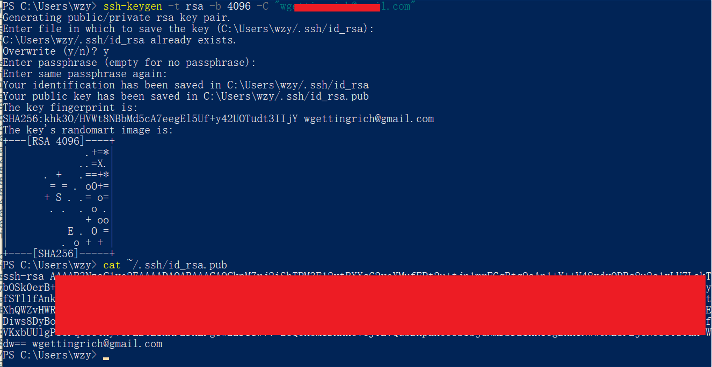
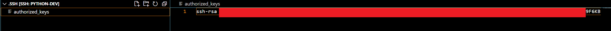

# Python项目

|    项目     |           用处           |                             地址                             |
| :---------: | :----------------------: | :----------------------------------------------------------: |
| `EnvMaster` | 重装电脑后，一键安装环境 | `https://github.com/ByteQuestor/python-learn/tree/main/project/EnvMaster` |

# Python远程开发配置免密登录

> VSCode远程开发的时候，甚至切换个目录都要输入密码，所以记录下配置远程密钥

### 1. 生成 SSH 密钥

在你的本地机器（Windows）上打开终端（如 PowerShell 或 Git Bash），运行以下命令：

```shell
ssh-keygen -t rsa -b 4096 -C "$email"
```

按提示操作：

- **保存路径**：一定要记住
- **输入密码**：不要设置密码，因为设置密码后，他会让输入密钥的密码，一路回车即可

### 2. 将公钥复制到服务器

使用以下命令将公钥复制到服务器（替换为你的服务器地址）：

```shell
cat ~/.ssh/id_rsa.pub
```

进入容器，反正就是要连哪个配置哪个，在以下路径，如果没有创建一个，**将密钥粘贴进去**

```shell
/root/.ssh/authorized_keys
```

> 如果是手工创建的文件，则需要做以下操作

---

**检查文件权限**，权限问题是导致 SSH 密钥认证失败的常见原因之一，如果在一开始没有，手动创建的`/root/.ssh/authorized_keys`，需要设置权限
在远程服务器上，`~/.ssh`目录的权限应该是700，`~/.ssh/authorized_keys`文件的权限应该是600。
可以使用以下命令来检查和设置权限：

所以需要进行以下操作：

+ 对于~/.ssh目录：`chmod 700 ~/.ssh`
+ 对于`~/.ssh/authorized_keys`文件：`chmod 600 ~/.ssh/authorized_keys`

**如果权限设置不正确，SSH 服务可能会忽略这些文件，从而导致密钥认证失败。**

---

在`VSCode`添加以下内容：（之前生成的时候提示了路径）

```ini
Host python-dev
  HostName 192.168.3.41
  Port 10008
  User root
  ForwardAgent yes
  IdentityFile C:\Users\wzy/.ssh/id_rsa  # 指向保存的路径
```

### 3. 测试无密码登录

现在可以尝试通过以下命令登录：

```shell
ssh python-dev
```

如果配置正确，就够无密码登录到服务器，换文件夹也不用再输入密码了

> 图示全过程



然后在`/root/.ssh/authorized_keys`下面创建



然后记得去容器里同样的位置添加


# Python学习记录